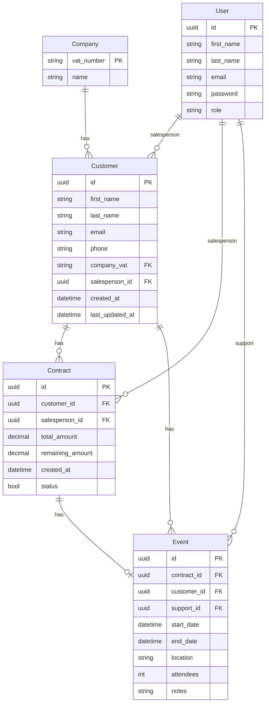

# CRM Epic Events
A CLI-based Customer Relationship Management tool built for Epic Events, 
a company that organises events for its clients. 
It manages the full lifecycle of customers, companies, contracts, and events, 
with role-based access control across three departments: Sales, Support, and Management.

This project is an exercise in a **Python** course.
This main goal is to develop back-end skills, covering relational database design, 
secure authentication, and error monitoring.
It implements a structured data model(customers, companies, contracts, events) 
with role-based access control, JWT authentication, and Sentry integration for error tracking.


## Tech Stack
- **Python 3.12+** 
- **SQLAlchemy 2.0** as ORM
- **PostgreSQL 17** as DB
- **Alembic** for database migrations
- **Sentry** for error monitoring
- **uv** for dependency management

## 🗄️ Database Schema

The database schema is available as a class diagram:

👉 [View the database schema](docs/class_diagram.drawio)

> The `.drawio` file can be viewed directly on GitHub or opened with [draw.io](https://app.diagrams.net/).

Here is a representation with Mermaid.



## Running Locally
Prerequisites
Docker and Docker Compose
just (recommended)
uv (optional, for running outside Docker)

1. Environment Variables
Copy the template below into a .env file at the project root and fill in the values:
```bash
APP_ENV=
# PostgreSQL database URL - filled with default values to match the docker compose config
DB_NAME=crm_db
POSTGRES_USER=docker_crm_db_user
POSTGRES_PASSWORD=crm_db_password
#local DB
#DB_HOST=
#DB_PORT=
#docker DB
DB_HOST=crm_db
DB_PORT=5432

# Auth env variables - filled with default value for test
SECRET_KEY=default_secret_key
AUTH_ALGORITHM=H256
ACCESS_TOKEN_LIFETIME=10
REFRESH_TOKEN_LIFETIME=1

# Sentry env variables - optional
SENTRY_DSN=
```

For a quick local setup with Docker, 
the values in compose.local.yml are pre-configured and ready to use — 
you only need to set the auth and optional Sentry variables.

2. With Docker + just (recommended)
```bash
# Build and start containers (PostgreSQL + app)
just up

# Apply database migrations
just db-upgrade

# Run the CRM
just exec crm
```
That's it. The app runs interactively inside the container.

3. With Docker Compose only (no just)
```bash
# Build and start containers
docker compose -f docker/compose.local.yml up --build -d

# Apply migrations
docker compose -f docker/compose.local.yml exec crm-app uv run alembic upgrade head

# Run the CRM
docker compose -f docker/compose.local.yml exec crm-app uv run crm
```

4. Without Docker (uv only)
Requires a local or remote PostgreSQL instance. 
Set DB_HOST and DB_PORT accordingly in your .env.
```bash
# Install dependencies
uv sync

# Apply migrations
uv run alembic upgrade head

# Run the CRM
uv run crm
```

## Useful Commands

| Command                  | Description                                       |
|--------------------------|---------------------------------------------------|
| `just up`                | Build and start all containers                    |
| `just down`              | Stop and remove containers                        |
| `just clean`             | Stop containers and remove all volumes            |
| `just db-upgrade`        | Apply all pending migrations                      |
| `just db-downgrade`      | Roll back the last migration                      |
| `just migrate "message"` | Generate a new migration                          |
| `just exec crm`          | Run the CRM inside the container                  |
| `just check`             | Run linter and formatter (ruff)                   |
| `just test`              | Run pytest for all the tests |

## First Use
1. **Register** an account via the CLI guest menu.
2. A **Manager** must log in and assign your role before you can access the system.
3. Log in and navigate the menu according to your role.


## Test Users

When running in `local` environment, three test users are automatically created at startup:

| Role    | Email              | Password |
|---------|--------------------|---|
| Manager | `manager@test.com` | `1` |
| Support | `support@test.com` | `2` |
| Sales   | `sales@test.com`   | `3` |
| Sales 2 | `sales2@test.com`  | `4` |

> These accounts are intended for development and testing only. Do not use them in production.

---

## 👤 Author
Arnaud Goguelin
